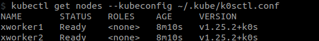

# Setup k8s (Kubernetes) cluster in local environment using Vagrant and k0s
Original from [[Kube 103.2]  Bootstrapping multi node K0S Kubernetes cluster of JustmeAndOpenSource](https://www.youtube.com/watch?v=5n67mohikjY&t=26s)


## Setup Vagrant
### Install virtualbox
Download page: [Virtualbox](https://www.virtualbox.org/wiki/Downloads)

#### For Ubuntu
```bash
sudo apt install virtualbox
```
### Install Vagrant
Vagrant download page: [Vagrant](https://developer.hashicorp.com/vagrant/downloads)

#### For Ubuntu
Current version **Vagrant 2.3.2**
```bash
wget https://releases.hashicorp.com/vagrant/2.3.2/vagrant-2.3.2-1.x86_64.rpm

sudo rpm -i vagrant-2.3.2-1.x86_64.rpm
```
### Vagrantfile
Create file name Vagrantfile in working directory

The content of this file is:
- Create a vm named master that:
    - Use ubuntu 20.04 image
    - Has 1 CPU and 1GB RAM
    - Has a private network with IP 192.168.56.10
- Create 2 vm:
    - Named worker1 and worker2
    - Has 1 CPU and 1GB RAM
    - Has a private network with IP
        - 192.168.56.11
        - 192.168.56.12
```
# -*- mode: ruby -*-
# vi: set ft=ruby :

ENV['VAGRANT_NO_PARALLEL'] = 'yes'

Vagrant.configure(2) do |config|

  config.vm.provision "shell", path: "bootstrap.sh"

  config.vm.define "xmaster" do |node|

    node.vm.box               = "generic/ubuntu2004"
    node.vm.box_check_update  = false
    node.vm.box_version       = "3.3.0"
    node.vm.hostname          = "xmaster.example.com"

    node.vm.network "private_network", ip: "192.168.56.10"

    node.vm.provider :virtualbox do |v|
      v.name    = "xmaster"
      v.memory  = 1024
      v.cpus    = 1
    end

    node.vm.provider :libvirt do |v|
      v.nested  = true
      v.memory  = 1024
      v.cpus    = 1
    end

  end

  NodeCount = 2

  (1..NodeCount).each do |i|

    config.vm.define "xworker#{i}" do |node|

      node.vm.box               = "generic/ubuntu2004"
      node.vm.box_check_update  = false
      node.vm.box_version       = "3.3.0"
      node.vm.hostname          = "xworker#{i}.example.com"

      node.vm.network "private_network", ip: "192.168.56.1#{i}"

      node.vm.provider :virtualbox do |v|
        v.name    = "xworker#{i}"
        v.memory  = 1024
        v.cpus    = 1
      end

      node.vm.provider :libvirt do |v|
        v.nested  = true
        v.memory  = 1024
        v.cpus    = 1
      end

    end

  end

end

```

### Bootstrap
The bootstrap.sh file is used to run bootstrap commands on all nodes

It will set authentication with password for root user 
user: root
password: admin

```bash
#!/bin/bash

# Enable ssh password authentication
echo "Enable ssh password authentication"
sed -i 's/^PasswordAuthentication no/PasswordAuthentication yes/' /etc/ssh/sshd_config
sed -i 's/.*PermitRootLogin.*/PermitRootLogin yes/' /etc/ssh/sshd_config
systemctl reload sshd

# Set Root password
echo "Set root password"
echo -e "admin\nadmin" | passwd root >/dev/null 2>&1
```

### Create the vm
Run the following command to create the vm
```bash
vagrant up
```

## Setup k0s
### Install k0sctl
Install k0s version 0.14.0 for Linux x64
```bash
wget https://github.com/k0sproject/k0sctl/releases/download/v0.14.0/k0sctl-linux-x64 -O k0sctl

chmod +x k0sctl

sudo mv k0sctl /usr/local/bin/

#Check path
which k0sctl

# Check version
k0sctl version
```

Or you can simply run [./install_k0sctl.sh](./install_k0sctl.sh) of this repo

### SSH
Create ssh key for k0sctl

```bash
ssh-keygen -t rsa -b 4096 -C "k0sctl" -f ~/.ssh/k0sctl

# You can add password for this key
```

Copy public key to all virtual machines
```bash
ssh-copy-id -i ~/.ssh/k0sctl.pub root@192.168.56.10

# You need to check if you can log in to all virtual machines with the ssh key
# ssh -i ~/.ssh/k0sctl root@192.168.56.10
```

Do the same for worker1 and worker2
### k0sctl.yaml

Setup K0s cluster with 1 master (controller) and 2 nodes

```yaml
apiVersion: k0sctl.k0sproject.io/v1beta1
kind: Cluster
metadata:
  name: k0s-cluster
spec:
  hosts:
  - ssh:
      address: 192.168.56.100
      user: root
      port: 22
      keyPath: <path-to-you-ssh-key>
    role: controller
    privateInterface: eth1
  - ssh:
      address: 192.168.56.101
      user: root
      port: 22
      keyPath: <path-to-you-ssh-key>
    role: worker
    privateInterface: eth1
  - ssh:
      address: 192.168.56.102
      user: root
      port: 22
      keyPath: <path-to-you-ssh-key>
    role: worker
    privateInterface: eth1
  k0s:
    version: 1.25.2+k0s.0
    dynamicConfig: false

```

### Setup cluster
To setup the cluster simple run 
```bash
k0sctl apply --config k0sctl.yaml
```

### Generate config file
```bash
k0sctl kubeconfig --config k0sctl.yaml > ~/.kube/k0sctl.conf
```

### Check cluster
```bash
kubectl get nodes --kubeconfig ~/.kube/k0sctl.conf
```



## To Cleanup the cluster
```bash
k0sctl reset --config k0sctl.yaml
```

## To Destroy the cluster
```bash
vagrant halt
vagrant destroy
```